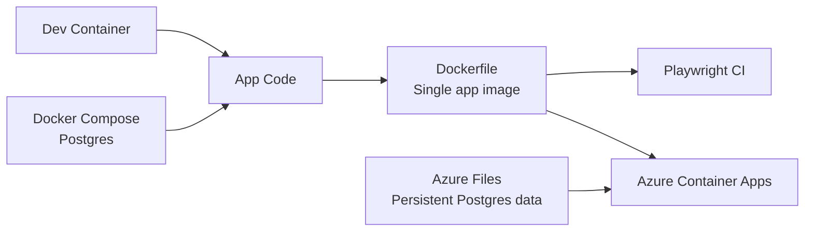

# The project in one slide

  

    
Problem

    <h2 class="!mt-2">Collect visit data without building a giant platform</h2>
    <ul>
      <li>Fastify API receives tracking events</li>
      <li>Prisma writes visit data into PostgreSQL</li>
      <li>React + Vite dashboard shows maps and aggregates</li>
      <li>GeoIP enrichment adds location context</li>
    </ul>
  

  

    
Why containers mattered

    <ul>
      <li>Same tooling for every contributor</li>
      <li>Same packaging model from laptop to cloud</li>
      <li>Same test environment on every CI run</li>
      <li>Cheap deployment with scale-to-zero</li>
    </ul>
  

<!--
Open with the product, then immediately frame containers as the delivery backbone.
-->

---
layout: center
class: text-left
---

# Container map

