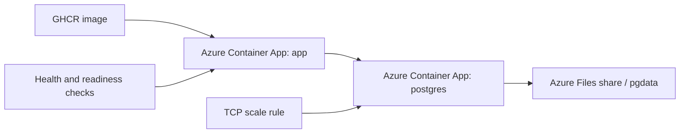

# Azure Container Apps gave us scale-to-zero without losing the database

## App container

- public ingress on port `3000`
- `minReplicas: 0`, `maxReplicas: 3`
- startup, liveness, and readiness probes tuned for cold starts

## PostgreSQL container

- internal TCP ingress on port `5432`
- `minReplicas: 0`, `maxReplicas: 1`
- TCP scaling rule wakes the DB on connection demand
- Azure Files share is mounted at `/var/lib/postgresql/data`

## The key win

We get a cheap demo-friendly deployment model:

- scale to zero when idle
- keep database files on persistent storage
- survive container restarts without losing analytics data

<!--
Source: infra/main.bicep and .github/workflows/deploy-azure-container-apps.yml
This is the cost story + resilience story in one slide.
-->
